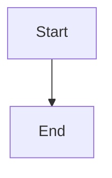

# Auth.js Multi-Client Documentation

This is the documentation site for the Auth.js Multi-Client authentication system. It is built using [Docusaurus](https://docusaurus.io/), a modern static website generator.

## Getting Started

### Prerequisites

- Node.js 18.x or later
- npm or yarn

### Installation

```bash
# Install dependencies
npm install

# Start the development server
npm start
```

The documentation site will be available at http://localhost:3000.

## Building the Documentation

To build the documentation site for production:

```bash
npm run build
```

The built site will be in the `build` directory.

## Deployment

### Manual Deployment

The documentation site can be manually deployed to GitHub Pages:

```bash
npm run deploy
```

### Automated Deployment with GitHub Actions

This repository is configured to automatically deploy the documentation to GitHub Pages when changes are pushed to the `main` branch. The deployment is handled by a GitHub Actions workflow defined in `.github/workflows/deploy-docs.yml`.

To trigger a manual deployment:

1. Go to the GitHub repository
2. Navigate to the "Actions" tab
3. Select the "Deploy Docusaurus to GitHub Pages" workflow
4. Click "Run workflow"

The documentation will be deployed to: https://biyani701.github.io/my-oauth-proxy/

## Project Structure

```
docs/
├── blog/                 # Blog posts
├── docs/                 # Documentation pages
│   ├── intro.md          # Introduction page
│   ├── installation.md   # Installation guide
│   └── ...               # Other documentation pages
├── src/
│   ├── components/       # React components
│   ├── css/              # CSS files
│   └── pages/            # Custom pages
├── static/
│   ├── img/              # Images
│   ├── robots.txt        # Robots file
│   └── sitemap.xml       # Sitemap file
├── docusaurus.config.js  # Docusaurus configuration
├── package.json          # Project dependencies
├── sidebars.js           # Sidebar configuration
└── README.md             # This file
```

## Adding Content

### Adding Documentation Pages

Add new Markdown files to the `docs` directory. The sidebar is configured in `sidebars.js`.

### Adding Blog Posts

Add new Markdown files to the `blog` directory. The format for blog post filenames is `YYYY-MM-DD-title.md`.

### Adding Mermaid Diagrams

Mermaid diagrams can be added to Markdown files using the following syntax:

```markdown

```

## Customization

### Changing the Theme

Edit the `src/css/custom.css` file to change the theme colors and other styles.

### Changing the Configuration

Edit the `docusaurus.config.js` file to change the site configuration, including the title, URL, and navigation.

## License

This documentation is licensed under the MIT License.
