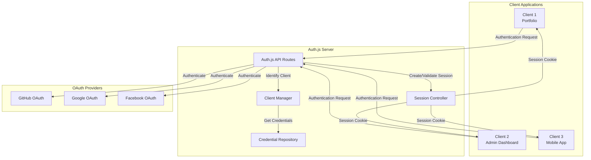
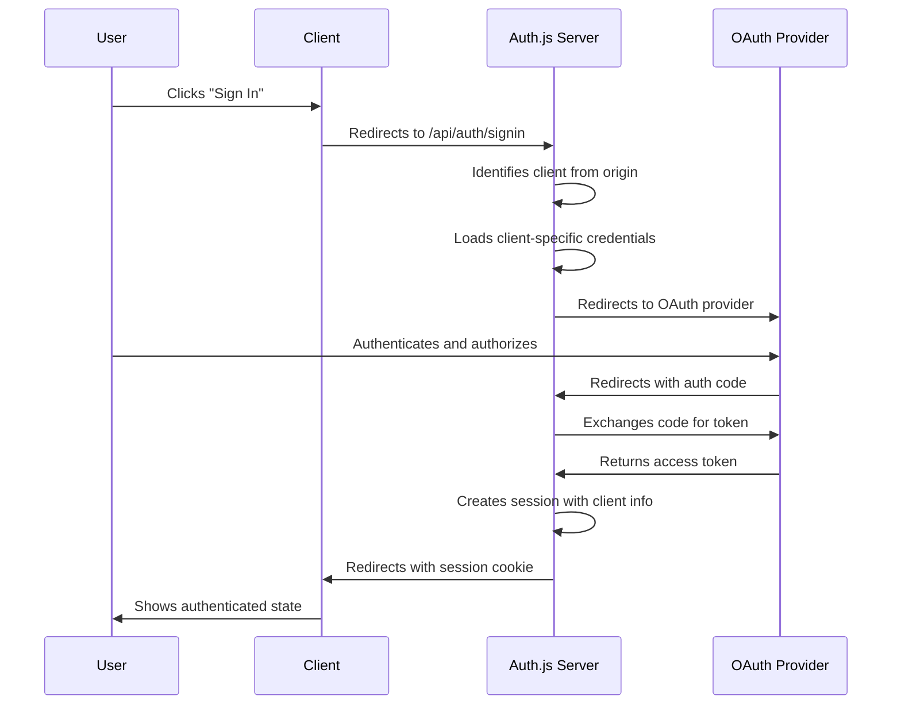

# Architecture Overview

This page provides a comprehensive overview of the Auth.js Multi-Client architecture.

## System Architecture

The Auth.js Multi-Client system consists of several key components that work together to provide authentication services to multiple client applications.

## Component Breakdown

### Client Applications

These are the various frontend applications that use the Auth.js server for authentication:

- **Portfolio Website**: The main public-facing website
- **Admin Dashboard**: An internal tool for administration
- **Mobile App**: A mobile application that uses the same authentication

### Auth.js Server

The core of the authentication system:

- **Auth.js API Routes**: The API endpoints that handle authentication requests
- **Client Manager**: Identifies clients based on their origin and manages client-specific settings
- **Credential Repository**: Stores and retrieves OAuth credentials for different clients
- **Session Controller**: Manages user sessions and cookies

### OAuth Providers

External authentication providers:

- **GitHub OAuth**: For authentication with GitHub accounts
- **Google OAuth**: For authentication with Google accounts
- **Facebook OAuth**: For authentication with Facebook accounts

## Authentication Flow

The following diagram illustrates the authentication flow when a user signs in:

## Data Flow

The data flow in the system follows these steps:

1. **Client Identification**: When a request comes in, the system identifies which client it's from based on the origin header
2. **Credential Selection**: The system selects the appropriate OAuth credentials for that client
3. **Authentication**: The user authenticates with the OAuth provider
4. **Session Creation**: A session is created with client information embedded
5. **Client Tracking**: The client origin is stored in the session for future reference

## Code Architecture

The codebase is organized into the following key files:

- **auth.config.ts**: Contains the configuration for Auth.js, including client identification and credential selection
- **auth.ts**: Implements the Auth.js handlers and session management
- **[...nextauth]/route.ts**: API routes for Auth.js
- **middleware.ts**: Handles CORS and other middleware concerns

## Security Considerations

The system implements several security measures:

- **Origin Validation**: Validates the origin of requests to prevent cross-site request forgery
- **Secure Cookies**: Uses secure, HTTP-only cookies for session management
- **Environment Variable Isolation**: Keeps sensitive credentials in environment variables
- **Cross-Origin Resource Sharing**: Implements proper CORS headers to control which clients can access the authentication API
