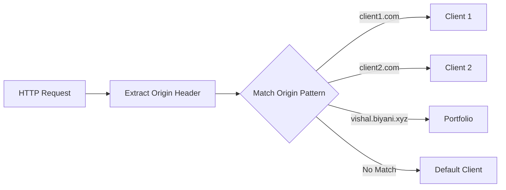

# Client Identification

This page explains how the Auth.js Multi-Client system identifies different client applications.

## Overview

Client identification is a core feature of the Auth.js Multi-Client system. It allows the authentication server to determine which client application is making the request and use the appropriate OAuth credentials for that client.

## How Clients Are Identified

Clients are identified based on their origin (domain) using the `identifyClient` function in `auth.config.ts`. The function examines the `origin` header from the HTTP request and maps it to a specific client ID.



## Client ID Enum

The system defines an enum of client IDs to ensure type safety and consistency:

```typescript
export enum ClientId {
  DEFAULT = 'default',
  CLIENT1 = 'client1',
  CLIENT2 = 'client2',
  PORTFOLIO = 'portfolio'
}
```

Each value in the enum represents a different client application:

- `DEFAULT`: Used when no specific client is identified
- `CLIENT1`: The first client application (e.g., running on localhost:3001 in development)
- `CLIENT2`: The second client application (e.g., running on localhost:3002 in development)
- `PORTFOLIO`: The portfolio client (e.g., running on GitHub Pages or vishal.biyani.xyz)

## Identification Logic

The identification logic is implemented in the `identifyClient` function:

```typescript
export const identifyClient = (origin?: string): ClientId => {
  if (!origin) return ClientId.DEFAULT;

  // Map origins to client IDs
  if (origin.includes('client1.com') || origin.includes('localhost:3001')) {
    return ClientId.CLIENT1;
  } else if (origin.includes('client2.com') || origin.includes('localhost:3002')) {
    return ClientId.CLIENT2;
  } else if (origin.includes('vishal.biyani.xyz') || origin.includes('github.io')) {
    return ClientId.PORTFOLIO;
  }

  // Default fallback
  return ClientId.DEFAULT;
};
```

This function:
1. Checks if an origin is provided (returns DEFAULT if not)
2. Checks if the origin matches any known client patterns
3. Returns the appropriate client ID based on the match
4. Falls back to DEFAULT if no match is found

## Adding New Clients

To add a new client to the system, you need to:

1. Add a new value to the `ClientId` enum
2. Add a new condition to the `identifyClient` function
3. Add the corresponding environment variables for the client's OAuth credentials

For example, to add a new client called "MOBILE_APP":

```typescript
// Step 1: Add to the enum
export enum ClientId {
  DEFAULT = 'default',
  CLIENT1 = 'client1',
  CLIENT2 = 'client2',
  PORTFOLIO = 'portfolio',
  MOBILE_APP = 'mobile_app'  // New client
}

// Step 2: Add to the identification logic
export const identifyClient = (origin?: string): ClientId => {
  if (!origin) return ClientId.DEFAULT;

  if (origin.includes('client1.com') || origin.includes('localhost:3001')) {
    return ClientId.CLIENT1;
  } else if (origin.includes('client2.com') || origin.includes('localhost:3002')) {
    return ClientId.CLIENT2;
  } else if (origin.includes('vishal.biyani.xyz') || origin.includes('github.io')) {
    return ClientId.PORTFOLIO;
  } else if (origin.includes('mobile-app.com') || origin.includes('localhost:3003')) {
    return ClientId.MOBILE_APP;  // New condition
  }

  return ClientId.DEFAULT;
};
```

## Testing Client Identification

You can test client identification by sending requests with different origin headers:

```bash
# Test with Client 1 origin
curl -H "Origin: http://localhost:3001" http://localhost:4002/api/auth/session

# Test with Client 2 origin
curl -H "Origin: http://localhost:3002" http://localhost:4002/api/auth/session

# Test with Portfolio origin
curl -H "Origin: https://vishal.biyani.xyz" http://localhost:4002/api/auth/session
```

The server logs will show which client was identified for each request.
