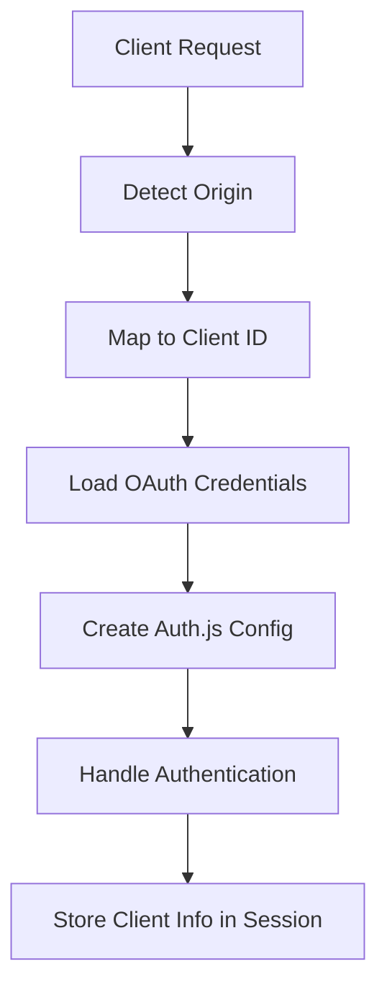

# Introduction

Welcome to the Auth.js Multi-Client documentation! This guide will help you understand and implement the multi-client authentication system using Auth.js.

## What is Auth.js Multi-Client?

Auth.js Multi-Client is an extension of the standard Auth.js (NextAuth.js) authentication library that allows a single authentication server to handle multiple client applications, each with their own OAuth credentials.

This is particularly useful when:

- You have multiple frontend applications that need to share the same authentication backend
- Different clients need to use different OAuth credentials (e.g., different GitHub OAuth apps)
- You want to track which client a user authenticated from

## Key Features

- **Dynamic Client Detection**: Automatically detects which client is making the authentication request based on the origin header
- **Client-Specific Credentials**: Uses different OAuth credentials for different clients
- **Origin Tracking**: Stores the client origin in the user's session for future reference
- **Flexible Configuration**: Easy to add new clients without changing the core authentication logic

## How It Works

The system works by:

1. Detecting the client's origin from the request headers
2. Mapping the origin to a specific client ID
3. Loading the appropriate OAuth credentials for that client
4. Creating a dynamic Auth.js configuration with those credentials
5. Storing the client information in the user's session

## Getting Started

To get started with Auth.js Multi-Client, follow these steps:

1. [Install the required dependencies](installation.md)
2. [Configure your environment variables](configuration.md)
3. [Set up your OAuth providers](github-setup.md)
4. [Deploy your authentication server](vercel-deployment.md)

## Example Use Cases

- A portfolio website and a separate admin dashboard sharing the same authentication backend
- Multiple microservices or micro-frontends that need unified authentication
- White-labeled applications where each client needs their own branding and OAuth credentials
